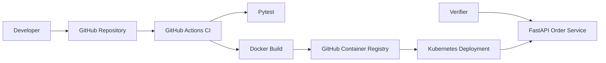

# Architecture

```mermaid
flowchart LR
    Dev[Developer] --> Git[GitHub Repository]
    Git --> GHA[GitHub Actions CI]
    GHA --> Test[Pytest]
    GHA --> Docker[Docker Build]
    Docker --> GHCR[GitHub Container Registry]
    GHCR --> K8s[Kubernetes Deployment]
    User[Verifier] --> App[FastAPI Order Service]
    K8s --> App
```
